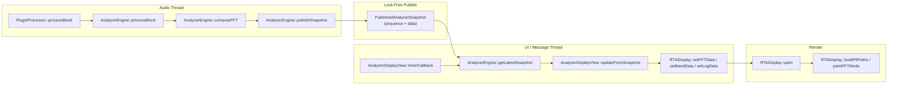

# AnalyzerPro Snapshot Signal Flow

## Verification (code-accurate)

- **Functions**: All referenced functions exist in the stated files (AnalyzerEngine.cpp/.h, AnalyzerDisplayView.cpp, RTADisplay.cpp, PluginProcessor.cpp). Processor class in code: `AnalayzerProAudioProcessor`.
- **Snapshot production**: `AnalyzerEngine::computeFFT()` fills `stagingSnapshot_`, then calls `publishSnapshot(snapshot)` (same ref); `publishSnapshot` copies into `published_.data` and increments `published_.sequence` (PublishedAnalyzerSnapshot).
- **UI consumption**: `AnalyzerDisplayView::timerCallback` → `getAnalyzerEngine().getLatestSnapshot(snapshot_)` → if valid, `updateFromSnapshot(snapshot_)` → `rtaDisplay.setFftMeta` / `setFFTData` / `setBandData` / `setLogData` / `setMultiTraceData`.

## Mermaid: Audio → Publish → UI → Render

---

## Probe Points (P0–P5)

| Probe | Location | Function / line reference |
|-------|----------|---------------------------|
| **P0** | Audio in, before analyzer | `PluginProcessor::processBlock` — after copy to `analysisBuffer`, before `analyzerEngine.processBlock(analysisBuffer)`. |
| **P1** | Snapshot produced (audio) | `AnalyzerEngine::publishSnapshot` — after copy into `published_.data`, after `published_.sequence.store(next, release)` and `hasNewData_.store(true, release)`. |
| **P2** | Snapshot read (UI) | `AnalyzerEngine::getLatestSnapshot` — after stable seqlock read (seq1 == seq2), before return true. |
| **P3** | UI applies snapshot | `AnalyzerDisplayView::updateFromSnapshot` — after `rtaDisplay.setFftMeta`, after copy into member vectors and weighting/ballistics, before mode-specific `setFFTData` / `setBandData` / `setLogData`. |
| **P4** | Display state updated | `RTADisplay::setFFTData` (or `setBandData` / `setLogData`) — after `state.fftDb` etc. assigned, after `invalidatePaths()` and `repaint()`. |
| **P5** | Pixels drawn | `RTADisplay::paintFFTMode` — after `buildFftPaths()` (if needed), during `drawSilkTrace` of cached paths. |

---

## Reset Semantics

### Plugin load / prepare

- **PluginProcessor::prepareToPlay**: Calls `analyzerEngine.prepare(sampleRate, samplesPerBlock)`. Engine sets `published_.sequence` to 1 if it was 0, and `published_.data.isValid = false`. No snapshot is published until the first valid FFT in `computeFFT` → `publishSnapshot`.
- **AnalyzerEngine::reset**: Called from `PluginProcessor::releaseResources`. Clears FFT and buffers; does not explicitly reset `published_.sequence` or `published_.data` (object remains valid; next prepare re-initializes as above).

### FFT size change

- **Audio thread**: `PluginProcessor::processBlock` detects FFT size param change and calls `analyzerEngine.requestFftSize(sizes[index])`. Engine sets `pendingFftSize_`, `fftResizeRequested_`, and invalidates `published_.data.isValid` (and metadata). `computeFFT` returns early while `fftResizeRequested_` is true, so no new snapshot is published during resize.
- **Message thread**: `AnalyzerDisplayView::timerCallback` calls `audioProcessor.getAnalyzerEngine().applyPendingFftSizeIfNeeded()`. Engine runs `initializeFFT(requested)` (resize buffers, set `published_.data.isValid = false`, update `published_.data.fftSize` / `numBins` / `fftBinCount`). Sequence is not reset; only validity and dimensions change. Next valid FFT after resize will publish again.

### Trace enable/disable

- Trace visibility (L/R/Mono/Mid/Side/RMS) is read from APVTS in `AnalyzerDisplayView::timerCallback` and passed to `RTADisplay::setTraceConfig`. No engine or snapshot reset; only which traces are drawn changes. Snapshot pipeline and sequence are unchanged.

### No audio

- If no audio is present, `AnalyzerEngine::processBlock` still runs but FIFO never reaches `samplesCollected >= currentHopSize`, so `computeFFT` is not called and no new snapshot is published. UI continues to call `getLatestSnapshot`; it either gets the last stable snapshot (unchanged) or, if no snapshot was ever published, returns false. Display holds last valid frame or shows previous state; no explicit “reset” of snapshot data when audio stops.

---

## Decay / animation without new snapshots

- **AnalyzerDisplayView::timerCallback** (60 Hz): When no new snapshot is available, the timer still runs **minDbAnim_.getNextValue()** and **rtaDisplay.setDbRange()**, and when **minDbAnim_.isSmoothing()** it calls **repaint()**. When **(minDbAnim_.isSmoothing() || peakScaleDirty_ || flashActive) && hasLastValid_** is true, the same timer re-feeds last valid vectors (**fftDb_**, **fftPeakDbDisplay_**, **peakHoldDbDisplay_**, etc.) to **rtaDisplay.setFFTData** / **setBandData** / **setLogData** without a new **getLatestSnapshot** / **updateFromSnapshot** for that tick. So dB range animation, peak flash, and peak remap can advance visuals without a new engine snapshot.
- **RTADisplay**: No internal Timer. **paintFFTMode** → **drawSilkTrace** uses **juce::Time::getMillisecondCounterHiRes()** for peak-trace shimmer (time-based alpha). Repaints show slightly different highlight on the same path data; no data decay inside RTADisplay.
- **PluginProcessor**: **StandalonePersistence::timerCallback** (standalone only, one-shot 10 ms) is for init only; it does not drive analyzer or display.
